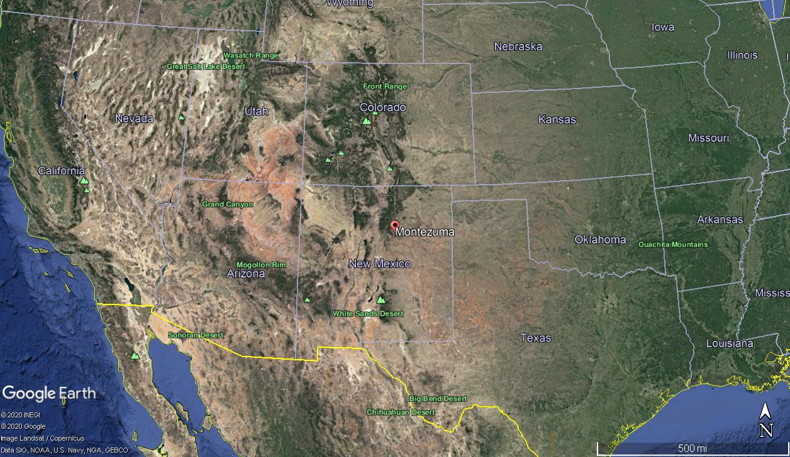

Streamflow data from gauge 08380500 (Gallinas Creek near Montezuma), Latitude 35°39'07.18", Longitude 105°19'07.79"

Tree ring data from ITRDB



![Bounding Box for retrieving ITRDB tree ring chronologies]


```{r}
devtools::load_all()

## hide this

```

The first helpful function if you've downloaded tree ring data from the ITRDB is parse_json(), which creates a table from JSON metadata files. You will need to indicate the directory location for the folder containing the .json metadata files using the dir = argument. When center = TRUE, the mean between the minimum/maximum elevation, northernmost/southernmost latitude, and easternmost/westernmost longitude is reported. The output for this function is a dataframe.

```{r}
metadata_full <- parse_json(dir = system.file("extdata/metadata", package = "pcreg", mustWork = TRUE), center = TRUE)

metadata_full

```

This allows you to do a bulk download of data, then filter based on variables you might care about for your study, such as species, elevation, chronology length, etc. We will filter these data to make sure that we don't include any datasets that end before 1970 to maximize our calibration/validation periods.

```{r}
metadata <- metadata_full %>% dplyr::filter(mostRecentYearCE > 1970)

```

There are two functions that will filter your chronology based on spatial location. The first filters chronologies based on a radius from a particular point. The inputs are the metadata file with lat/long, the lat/lon of the center point of the radius, and the radius you want to include in km. The output of this function is a list of chronology IDs that fall within that radius

we will filter within a 75km radius of the streamgauge, and save the output as an object called select_crns_rad.

```{r}
## filter chronologies based on radius from a point
select_crns_rad <- filter_rad(x = metadata, cent.lat = 35.65, cent.lon = -105.32, radius = 150, plot = TRUE)

```


The other option for spatial filtering is by using a climate footprint (cite harley, s. maxwell, j. maxwell). This requires a climate footprint spatial data file, in most cases this of correlation between streamflow and some metric of precipitation or soil moisture. 

This example uses a .nc file created in the KNMI climate explorer, https://climexp.knmi.nl/start.cgi. This file can be loaded in using the raster package

```{r}
footprint <- raster::raster("../inst/extdata/gallinas_cf.nc")
  

```

select_crns_fp() filters the tree ring chronologies based on the location within the footprint.

In this example, we select chronologies that are in an area where correlation between streamflow and precipitation is 0.5 or higher (r = 0.5) -* for the sake of keeping things small *


```{r}
select_crns_fp <- filter_foot(x = metadata_full, footprint = footprint, r = 0.5, cent.lat = 35.65, cent.lon = -105.32, radius = 150, plot = TRUE)

```

The load_crns function pulls the chronologies that are selected by the previous spatial filtering functions from the folder where you .crns files are.

```{r}
crns_df <- load_crns(dir = system.file("extdata/crns", package = "pcreg", mustWork = TRUE), crns = select_crns_fp)
crns_df <- dplyr::arrange(crns_df, year)

```

Next, you'll need to bring in the climate data. I've saved the streamflow data I downloaded from https://waterdata.usgs.gov/nwis as a csv file. The load_clim function, which aggregates the climate data based on the months of interest, require that these data be in 13 column or long (3 column) format.

```{r}
climate <- read.csv(system.file("extdata/gallinas_flow.csv", package = "pcreg"))
names(climate) <- c("year", c(1:12))

```

load_clim()

```{r}
climate <- load_clim(clim = climate, mos = -8:7, method = "mean", prewhiten.clim = TRUE)
```

eval_clim() calculates correlations between the climate variable and the chronologies. 
```{r}
data <- eval_clim(crns = crns_df, lead = 1, lag = 1, prewhiten.crn = TRUE, climate = climate, calib = 1928:1945, valid = 1946:1967, cor.window = "calib", type = "pearson", alternative = "two.sided", r = .25, alpha = 0.9, print.out = TRUE, save.out = "csv", dir = "test/")
```

pcreg() 
```{r}
recon <- pcreg(data = data, pc.calc = "calib", select.pc = "eigenvalue1", scale.var = "calib", plot = TRUE, weight = NULL, cum.perc = NULL, save.out = "csv", dir = dir)
```

```{r}
recon$validation_stats
data$nests

```
